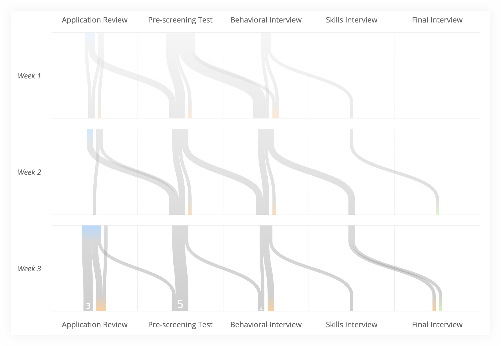
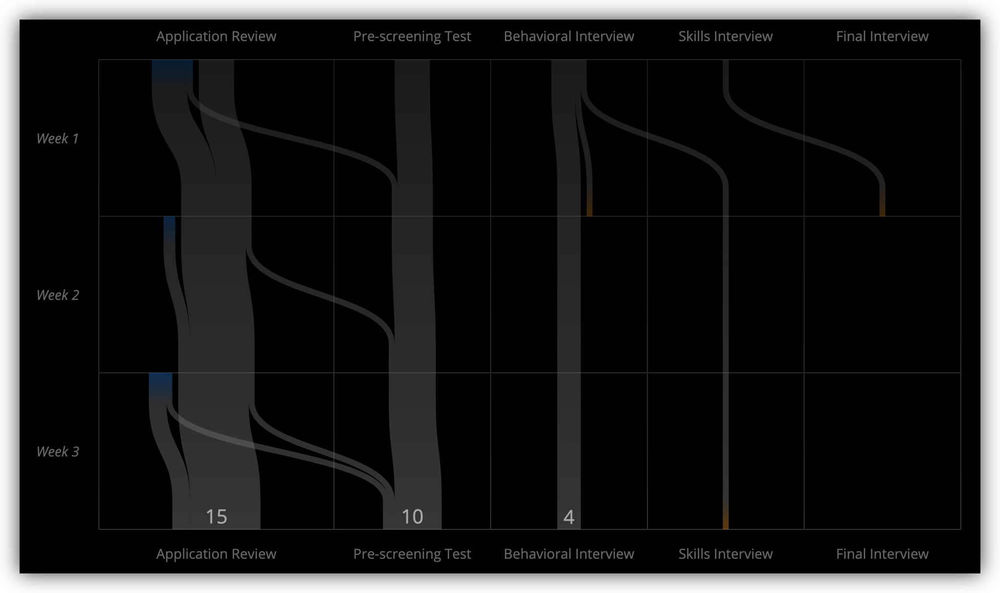
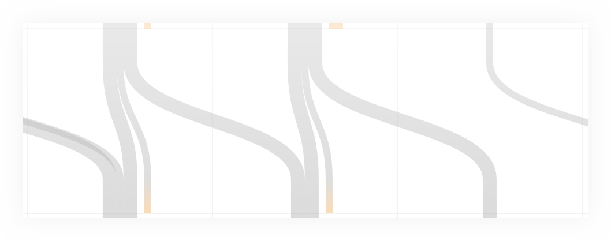

# Introduction

This is a pipeline visualization inspired by [Sankey diagrams](https://en.wikipedia.org/wiki/Sankey_diagram) and [this diagram by the New York Times](http://www.nytimes.com/newsgraphics/2013/11/30/football-conferences/index.html), which I will call a _spaghetti diagram_.

It has been originally developed to analyze a recruiting pipeline&nbsp;— people passing from one stage to another over time&nbsp;— but can be applied to other use cases.

You can play with a live demo [here](https://stanch.github.io/pipeline/).

  
  
   
  
  

# Features

Let’s use recruiting as an example:
* On the horizontal axis, each column is a stage that a candidate can pass through during the recruiting process.
* On the vertical axis, each row is a week (but could be any other unit of time).
* Lines represent candidates. They are colored blue when the candidate enters the pipeline, orange when the candidate fails a stage and green when the candidate passes the final stage and is hired.

The pipeline diagram combines several views, including both Sankey and spaghetti modes, in one interactive visualization. _What kind of questions can it answer?_

  

## Flowing or stagnant?

In a well-oiled, flowing pipeline you will notice significant horizontal motion:

On the other hand, if nobody is passing from one stage to another, the diagram will be dominated by straight vertical lines:

A line crossing other lines could be another sign that something is stuck. This is because at each stage, the candidates are ordered by the time they reached the stage. So in the ideal world, the ones on the right&nbsp;— the first to arrive&nbsp;— would also be the first to advance:

## Big or small?

Looking at the width of different stages quickly reveals the size of the pipeline. The last row includes the current numbers.

## Growing or shrinking?

Focus on the width of blue accents each week&nbsp;— you can tell whether the number of new candidates is decreasing or increasing over time.

The disconnected mode&nbsp;— which works better for large pipelines&nbsp;— also makes it easier to see how many candidates are new and how many carried over from the previous week.

&nbsp;

## Easy or hard?

The width of orange accents gives an idea of which stages have higher fail rates.

## What happened to?..

By hovering on individual lines or on the numbers that appear in each cell, you can investigate the paths of specific candidates.

# Usage

See [the demo source code](https://github.com/stanch/pipeline/blob/master/index.html#L54) for an example. Note: I’ve developed this project a while back as a part of a larger project, and never needed to publish it. I am happy to look into publishing on NPM if there is any interest though :)
